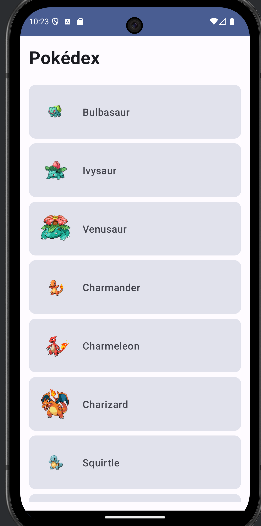
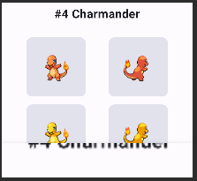

# Laboratorio-5---Network-access-with-Retrofit

##  Descripción del Proyecto
Aplicación Android desarrollada en Kotlin que consume la PokeAPI para mostrar información sobre Pokémon, implementando conceptos de consumo de APIs REST, permisos de internet, y desarrollo moderno con Jetpack Compose.

##  Características Principales
- **Lista de Pokémon**: Muestra los primeros 100 Pokémon obtenidos desde la PokeAPI
- **Detalles del Pokémon**: Pantalla con 4 imágenes desde diferentes ángulos.
- **Navegación**: Implementación con Navigation Component para Compose
- **Arquitectura MVVM**: Separación clara de responsabilidades con ViewModel
- **Consumo de API**: Uso de Retrofit para llamadas HTTP y Gson para parsing JSON

##  screenshots

